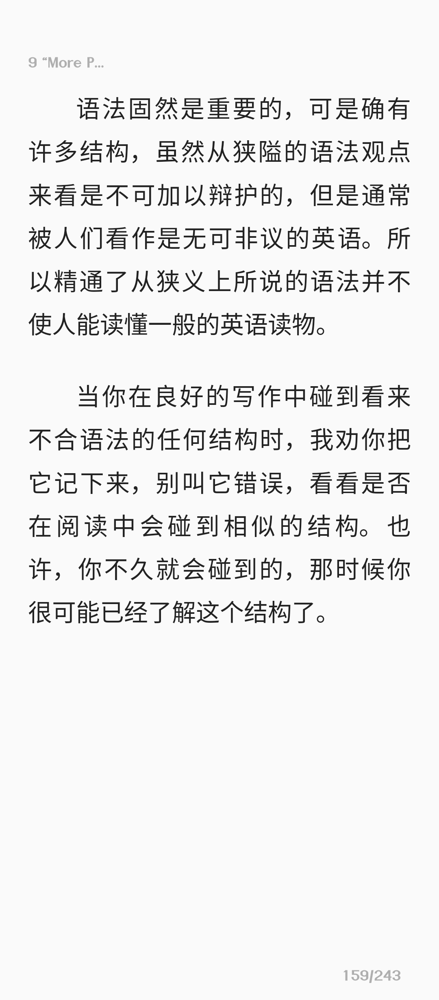

### 日记

杨灵薇终于把照片发给我了。

<video src="/videos/VID_20260404_113132_799.mp4" controls></video>

这周一来就叫换座位，刘钰微坐的很远，我和陈何子谦坐第二排，我坐左边。如果按靠窗顺序我在第三列。杨灵薇和刘钰微坐附近。

这周学英语还算稍微勤奋，把英语周报拿到了 52 期，下周一定能做完。物理、化学、生物、数学仍然没有希望。

今天看完了许冠文的电影《鸡同鸭讲》。

这些观点实在与我不谋而合，好像我从来都在学习英语的“正确”的路上走着。

---

### 摘抄

> [!important]
> 读者，在你的阅读中，记下合于习语但在你看来不够合于语法的那些结构。把它们记入心中，并设法用在你的写作中。尤其重要的是：你可能恰巧像我在上文中说过的只知道足够的语法从而犯错的人们中的一个。
> 
> 可是你不可以认为习语和语法总是不相容的。合于习语的东西，合于语法的大大多于不合语法的。我的意思只是：并非每个合于习语结构的都是可以用语法来解释的，也不是每个严格合于语法结构的都是合于习语的。

:::note
不论一个英语学习者读什么东西，我认为他该把语言看作主要的东西。举例来说，读了前面这一句（“Whatever a learner of English reads，he should，in my opinion，regard the language as the main thing.”），除了了解它的意思以外，应该注意到“whatever”的让步用法、“in my opinion”、“regard …as…”和“the main thing”。这样，他的确学到一些英语，虽然他所读的东西在别的方面也许恰巧既没有趣味又没有教益。可以可靠地说，这种学习作文的方法比读而思考作文的原则要好得多。
:::